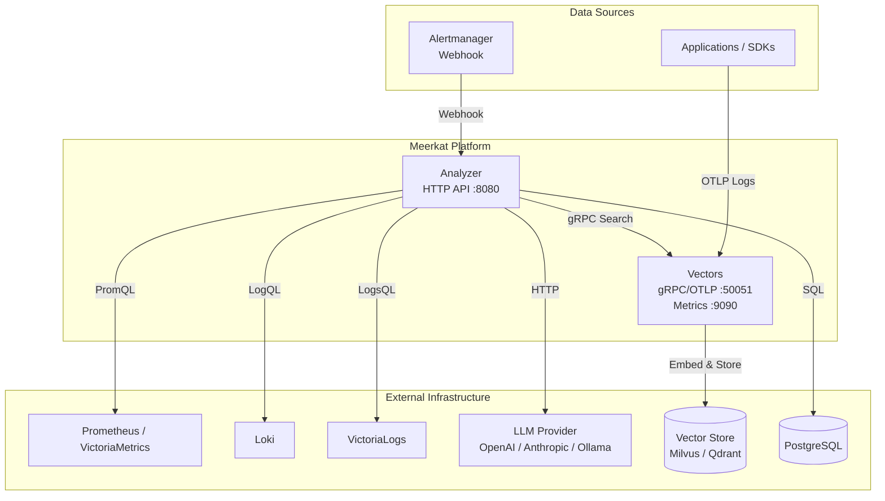
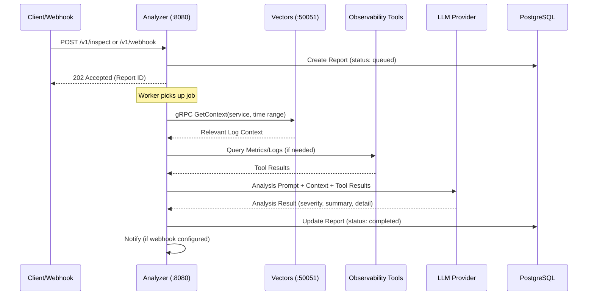
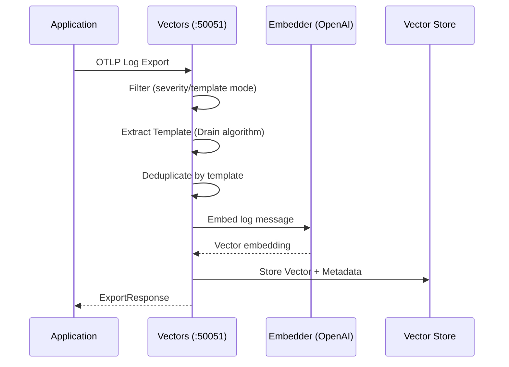

# Meerkat

AI-powered observability agent that watches your infrastructure like a meerkat on sentinel duty.

## Overview

Meerkat is an AI-driven observability platform consisting of **two independently deployable services**:

- **Analyzer**: HTTP API server that orchestrates AI analysis, report management, scheduling, and webhook reception
- **Vectors**: gRPC + OTLP server for log ingestion, semantic search, template extraction, and vector storage

## Architecture



### Component Interaction



### Log Ingestion Flow



### Analysis Detail Flow

```mermaid
sequenceDiagram
    participant Worker as Analysis Worker
    participant Report as Report Repository
    participant Analyzer as Analyzer Service
    participant Vectors as Vectors Client
    participant Tools as Tool Registry
    participant LLM as LLM Provider

    Worker->>Report: Get report by ID
    Worker->>Vectors: GetContext(query, time range)
    Vectors-->>Worker: Log entries (semantic search)

    loop Max Iterations
        Worker->>Analyzer: Analyze with context
        Analyzer->>LLM: Send prompt + available tools
        LLM-->>Analyzer: Response (tool call or final answer)

        alt Tool Call
            Analyzer->>Tools: Execute tool (prometheus/loki/victorialogs/search_logs)
            Tools-->>Analyzer: Tool result
            Analyzer->>Analyzer: Truncate if needed
        else Final Answer
            Analyzer-->>Worker: Analysis result
            break
        end
    end

    Worker->>Report: Update with result
    Worker->>Worker: Send notification (if configured)
```

## Services

| Service | Protocol | Default Port | Responsibility |
|---------|----------|--------------|----------------|
| **Analyzer** | HTTP (REST) | 8080 | AI analysis, report management, scheduling, webhook reception |
| **Vectors** | gRPC + OTLP | 50051 | Log ingestion, semantic search, vector storage |
| **Vectors** | HTTP | 9090 | Prometheus metrics, health checks |

## Supported Tools

The Analyzer can invoke the following tools during analysis:

| Tool | Description | Query Language |
|------|-------------|----------------|
| **prometheus** | Query metrics from Prometheus or VictoriaMetrics | PromQL |
| **loki** | Query logs from Loki | LogQL |
| **victoria_logs** | Query logs from VictoriaLogs | LogsQL |
| **search_logs** | Semantic search over ingested logs via Vectors | Natural language |

## Project Structure

```text
.
├── api/                          # API definitions
│   ├── openapi.yaml              # OpenAPI 3.0 spec
│   ├── paths/                    # OpenAPI path definitions
│   ├── schemas/                  # OpenAPI schema definitions
│   └── proto/vectors/v1/         # Protobuf service definitions
├── build/docker/                 # Dockerfiles
├── cmd/                          # Entry points
│   ├── meerkat/                  # CLI client
│   └── meerkat-server/           # Server binary commands
├── deployment/
│   └── charts/meerkat/           # Helm chart
│       ├── templates/            # K8s manifests
│       └── values.yaml           # Default configuration
├── internal/                     # Private packages
│   ├── analyzer/                 # AI analysis engine (LLM interaction, tool orchestration)
│   ├── cmd/                      # Command implementations (Run functions)
│   ├── config/                   # Configuration loading & validation
│   ├── embed/                    # Text embedding (OpenAI-compatible)
│   ├── ent/                      # Ent ORM generated code
│   ├── errs/                     # Custom error types
│   ├── httphandler/              # HTTP handlers (OpenAPI-generated server implementation)
│   ├── inspect/                  # Report lifecycle & worker pool management
│   ├── logger/                   # Structured logging utilities
│   ├── notify/                   # Notification service (webhook)
│   ├── report/                   # Report domain & repository
│   ├── schedule/                 # Scheduled analysis jobs
│   ├── server/                   # Server DI assembly (analyzer, database, tools, provider)
│   ├── tool/                     # Observability tool integrations (prometheus, loki, victorialogs, search_logs)
│   ├── vectors/                  # Log ingestion pipeline (OTLP, embedding, filtering)
│   ├── vectorsclient/            # gRPC client for Vectors service
│   ├── vectorspb/                # Generated protobuf code
│   └── vectorstore/              # Vector store clients (Milvus, Qdrant)
├── pkg/api/                      # Generated OpenAPI client/server (ogen)
├── test/
│   ├── e2e/                      # End-to-end tests (real binary)
│   ├── integration/              # Integration tests (in-memory DI)
│   └── kind/                     # Kind cluster deployment tests
├── Makefile                      # Build automation
├── config.example.yaml           # Example configuration
└── go.mod                        # Go module definition
```

## Quick Start

### Prerequisites

- Go 1.26+
- PostgreSQL 14+
- Milvus or Qdrant (vector store)
- OpenAI API key (or compatible provider: Anthropic, Ollama, vLLM, etc.)
- (Optional) Helm 3+ for Kubernetes deployment

### Configuration

```bash
# Copy example config
cp config.example.yaml config.yaml

# Edit config.yaml with your settings
```

```yaml
app:
  name: meerkat
  env: development
  debug: true
  log_level: info      # debug, info, warn, error
  log_format: json     # json, console

http:
  host: 0.0.0.0
  port: 8080

store:
  driver: postgres
  host: localhost
  port: 5432
  name: meerkat
  user: meerkat
  password: meerkat
  sslmode: disable

tools:
  prometheus:
    - name: vm
      url: http://localhost:8428

  victoria_logs:
    - name: vl
      url: http://localhost:9428

analyzer:
  provider: openai
  url: https://api.openai.com
  api_key: ""
  model: gpt-4o
  max_iterations: 10
  max_tokens: 4096
  temperature: 0.3
  system_prompt_file: config/system_prompt.txt
  skills_file: config/skills.yaml

scheduler:
  enabled: false
  jobs:
    - name: error-spike-check
      interval: 5m
      metric_query: "rate(http_errors_total[5m])"
      log_query: "level:error"

inspect:
  dedup_window: 5m

notify:
  webhook_url: ""
  min_severity: warning

embed:
  provider: openai
  api_key: ""
  model: text-embedding-3-small

vector_store:
  milvus:
    address: localhost:19530
    collection: logs
    dimension: 1536
    retention: 72h

vectors:
  enabled: true
  address: ":50051"
  ingest_batch_size: 100
  similarity_threshold: 0.7
  max_context_logs: 20
  filter_mode: template
  min_severity: info
  deduplicate_by_template: true
  retention: 72h
```

### Running Services

```bash
# Run database migrations
go run ./cmd/meerkat-server analyzer migrate apply

# Start Vectors server (log ingestion + search)
go run ./cmd/meerkat-server vectors serve

# Start Analyzer server (HTTP API + AI analysis)
go run ./cmd/meerkat-server analyzer serve
```

### CLI

```bash
# Build CLI
go build -o meerkat ./cmd/meerkat

# Trigger manual inspection
./meerkat inspect -q "Check for error spikes in the last hour"

# List reports
./meerkat report list

# Get specific report
./meerkat report get <id>
```

## Configuration Validation

All services validate configuration at startup:

```go
if err := cfg.Validate(); err != nil {
    return fmt.Errorf("validate config: %w", err)
}
```

Checks include:

- Port ranges (0-65535)
- Required database fields
- Analyzer provider (`openai` | `anthropic`)
- Vector store driver (`milvus` | `qdrant`)
- Filter mode (`all` | `severity` | `template`)
- Vectors address when enabled

## Filtering Modes

Vectors supports three log filtering modes during ingestion:

| Mode | Behavior |
|------|----------|
| **all** | All logs are vectorized (no filtering) |
| **severity** | Only logs with severity >= `min_severity` are vectorized |
| **template** | Drain algorithm extracts templates; duplicates are deduplicated (default) |

## Metrics

Vectors exposes Prometheus metrics on `:9090/metrics`:

- `vectors_ingest_total` -- Total ingested logs
- `vectors_ingest_deduplicated_total` -- Total deduplicated logs
- `vectors_search_duration_seconds` -- Search latency histogram
- `vectors_search_total` -- Total search requests
- `vectors_embed_duration_seconds` -- Embedding latency histogram

## Development

```bash
# Generate all code (ent, proto, ogen, mocks)
make gen

# Build binaries
make build

# Run unit tests
make test

# Run integration tests
make test-integration

# Run e2e tests (requires Docker)
make test-e2e

# Run Kind cluster tests (requires Docker + Kind)
make test-kind

# Run linter
make lint

# Format code
make fmt
```

## Deployment

### Docker

```bash
docker build -f build/docker/server.Dockerfile -t meerkat-server .
```

### Kubernetes (Helm)

```bash
# Install with default values
helm install meerkat ./deployment/charts/meerkat \
  --set vectors.enabled=true

# Install with custom values
helm install meerkat ./deployment/charts/meerkat \
  --values custom-values.yaml
```

### Service Ports

| Service | Port | Protocol | Purpose |
|---------|------|----------|---------|
| Analyzer | 8080 | HTTP | REST API |
| Vectors | 50051 | gRPC | Search / Ingest / GetContext / OTLP |
| Vectors | 9090 | HTTP | Metrics & Health |

## Security

- **TLS**: Analyzer HTTP server supports TLS via `http.tls.cert_file` and `http.tls.key_file`
- **gRPC TLS**: `vectorsclient` supports `WithTransportCredentials()` for secure inter-service communication
- **API Keys**: Embedder and LLM provider API keys are loaded from environment variables (never commit to VCS)
- **Database**: PostgreSQL connection uses SSL mode configuration

## License

Proprietary
