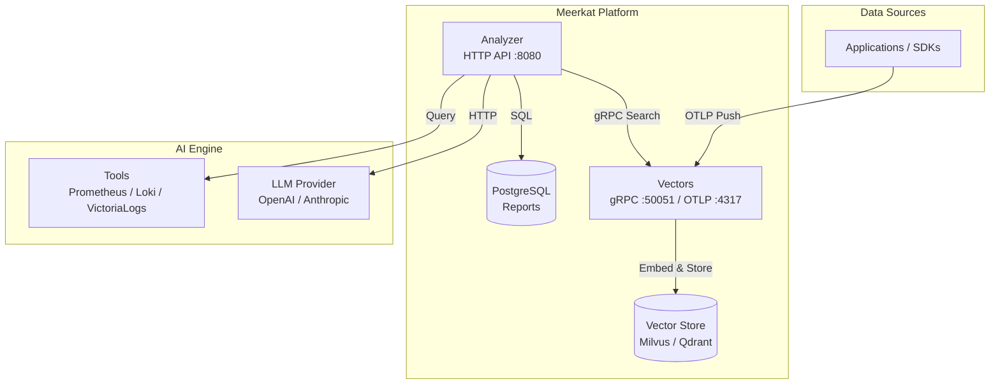
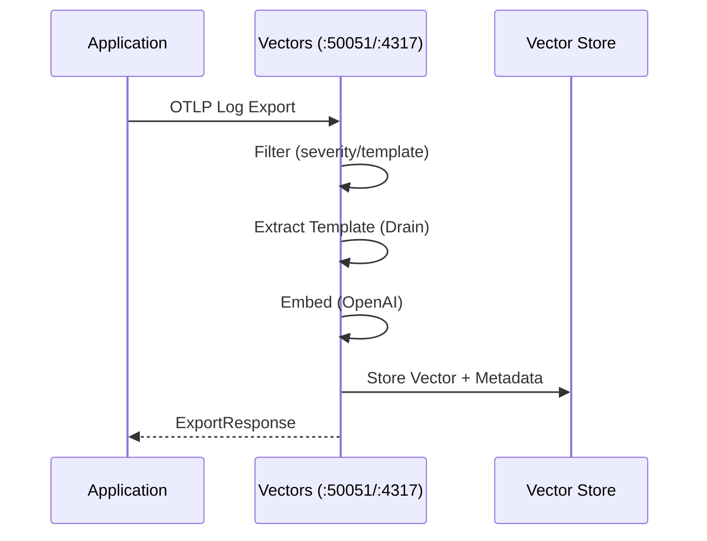
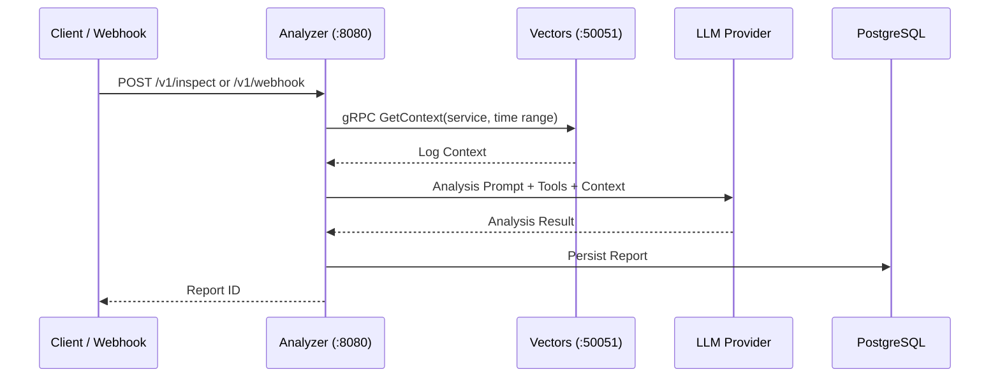

# Meerkat

AI-powered observability agent that watches your infrastructure like a meerkat on sentinel duty.

## Overview

Meerkat is an AI-driven observability platform consisting of **two independently deployable services**:

- **Analyzer**: HTTP API server that orchestrates AI analysis, report management, and scheduling
- **Vectors**: gRPC + OTLP server for log ingestion, semantic search, and vector storage

## Architecture



### Log Ingestion Flow



### Analysis Flow



## Services

| Service | Protocol | Default Port | Responsibility |
|---------|----------|--------------|----------------|
| **Analyzer** | HTTP (REST) | 8080 | AI analysis, report management, scheduling, webhook reception |
| **Vectors** | gRPC + OTLP | 50051 (gRPC), 4317 (OTLP), 9090 (metrics) | Log ingestion, template extraction, semantic search, vector storage |

## Project Structure

```text
.
├── api/                          # API definitions
│   ├── openapi.yaml              # OpenAPI 3.0 spec
│   ├── paths/                    # OpenAPI path definitions
│   ├── schemas/                  # OpenAPI schema definitions
│   └── proto/meerkatlogs/v1/     # Protobuf service definitions
├── build/docker/                 # Dockerfiles
├── cmd/                          # Entry points
│   ├── meerkat/                  # CLI client
│   └── meerkat-server/           # Server binaries
│       ├── analyzer/             # Analyzer server commands
│       └── vectors/              # Vectors server commands
├── deployment/
│   └── charts/meerkat/           # Helm chart
│       ├── templates/            # K8s manifests
│       └── values.yaml           # Default configuration
├── internal/                     # Private packages
│   ├── analyzer/                 # AI analysis engine
│   ├── config/                   # Configuration loading & validation
│   ├── discovery/                # Auto-discovery (K8s, Docker, Static)
│   ├── embed/                    # Text embedding (OpenAI)
│   ├── ent/                      # Ent ORM generated code
│   ├── errs/                     # Custom error types
│   ├── httphandler/              # HTTP handlers (analyzer API)
│   ├── inspect/                  # Report lifecycle & worker pool
│   ├── vectorsclient/               # gRPC client for Vectors
│   ├── meerkatlogspb/            # Generated protobuf code
│   ├── notify/                   # Notification service (Slack)
│   ├── report/                   # Report domain & repository
│   ├── schedule/                 # Scheduled analysis jobs
│   ├── server/                   # Server DI assembly
│   ├── tool/                     # Observability tool integrations
│   ├── vectors/                  # Log ingestion pipeline
│   └── vectorstore/              # Vector store clients (Milvus, Qdrant)
├── pkg/api/                      # Generated OpenAPI client/server
├── test/
│   ├── deploy/                   # Helm deployment tests (Kind)
│   ├── e2e/                      # End-to-end tests
│   └── integration/              # Integration tests
├── Makefile                      # Build automation
├── config.example.yaml           # Example configuration
└── go.mod                        # Go module definition
```

## Quick Start

### Prerequisites

- Go 1.26+
- PostgreSQL 14+
- Milvus or Qdrant (vector store)
- OpenAI API key (or compatible provider)
- (Optional) Helm 3+ for Kubernetes deployment

### Configuration

```bash
# Copy example config
cp config.example.yaml config.yaml

# Edit config.yaml with your settings
```

```yaml
app:
  name: meerkat
  env: development

http:
  host: 0.0.0.0
  port: 8080

store:
  driver: postgres
  host: localhost
  port: 5432
  name: meerkat
  user: meerkat
  password: meerkat

vectors:
  enabled: true
  address: ":50051"
  otlp_bind_addr: ":4317"
  filter_mode: template  # all | severity | template
  min_severity: info
  retention: 72h

embedder:
  provider: openai
  api_key: ${OPENAI_API_KEY}
  model: text-embedding-3-small

vector_store:
  milvus:
    address: localhost:19530
    collection: logs
    dimension: 1536
```

### Running Services

```bash
# Run database migrations
go run ./cmd/meerkat-server analyzer migrate apply

# Start Vectors server (log ingestion + search + OTLP)
go run ./cmd/meerkat-server vectors serve

# Start Analyzer server (HTTP API + AI analysis)
go run ./cmd/meerkat-server analyzer serve
```

### CLI

```bash
# Build CLI
go build -o meerkat ./cmd/meerkat

# Trigger manual inspection
./meerkat inspect -q "Check for error spikes in the last hour"

# List reports
./meerkat report list

# Get specific report
./meerkat report get <id>
```

## Configuration Validation

All services validate configuration at startup:

```go
if err := cfg.Validate(); err != nil {
    return fmt.Errorf("validate config: %w", err)
}
```

Checks include:

- Port ranges (0-65535)
- Required database fields
- Analyzer provider (`openai` | `anthropic`)
- Vector store driver (`milvus` | `qdrant`)
- Filter mode (`all` | `severity` | `template`)
- Vectors address when enabled

## Filtering Modes

Vectors supports three log filtering modes during ingestion:

| Mode | Behavior |
|------|----------|
| **all** | All logs are vectorized (no filtering) |
| **severity** | Only logs with severity ≥ `min_severity` are vectorized |
| **template** | Drain algorithm extracts templates; duplicates are deduplicated (default) |

## Metrics

Vectors exposes Prometheus metrics on `:9090/metrics`:

- `vectors_ingest_total` — Total ingested logs
- `vectors_ingest_deduplicated_total` — Total deduplicated logs
- `vectors_search_duration_seconds` — Search latency histogram
- `vectors_search_total` — Total search requests
- `vectors_embed_duration_seconds` — Embedding latency histogram

## Development

```bash
# Generate all code (ent, proto, ogen, mocks)
make gen

# Build binaries
make build

# Run unit tests
make test

# Run integration tests
make test-integration

# Run e2e tests (requires Docker)
make test-e2e

# Run linter
make lint

# Format code
make fmt
```

## Deployment

### Docker

```bash
docker build -f build/docker/server.Dockerfile -t meerkat-server .
```

### Kubernetes (Helm)

```bash
# Install with default values
helm install meerkat ./deployment/charts/meerkat \
  --set vectors.enabled=true \
  --set analyzer.enabled=true

# Install with custom values
helm install meerkat ./deployment/charts/meerkat \
  --values custom-values.yaml
```

### Service Ports

| Service | Port | Protocol | Purpose |
|---------|------|----------|---------|
| Analyzer | 8080 | HTTP | REST API |
| Vectors | 50051 | gRPC | Search/Ingest/GetContext |
| Vectors | 4317 | OTLP/gRPC | Log ingestion |
| Vectors | 9090 | HTTP | Metrics & Health |

## Security

- **TLS**: Analyzer HTTP server supports TLS via `http.tls.cert_file` and `http.tls.key_file`
- **gRPC TLS**: `vectorsclient` supports `WithTransportCredentials()` for secure inter-service communication
- **API Keys**: Embedder and LLM provider API keys are loaded from environment variables (never commit to VCS)
- **Database**: PostgreSQL connection uses SSL mode configuration

## License

Proprietary
